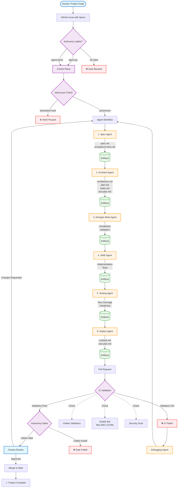

# Kerrigan Architecture

## High-Level Overview

Kerrigan is a multi-agent orchestration system that coordinates specialized AI agents through artifact-driven workflows. The system enables teams to deliver software projects with high quality and minimal human intervention, while maintaining strict human control over key decisions.

## Architecture Diagram

**Note**: This diagram is rendered using Mermaid syntax. If viewing on GitHub, the diagram should display automatically. If not rendering, see the text description below.

## Key Components

### 1. Control Plane

The control plane manages workflow execution and ensures human oversight:

- **Autonomy Gates** (`agent-gates.yml`): Label-based workflow control
  - `agent:go`: On-demand approval for single issues
  - `agent:sprint`: Sprint-mode approval for milestone work
  - `autonomy:override`: Human override for exceptional cases
  
- **Status Tracking** (`status.json`): Per-project workflow state
  - `active`: Agents may proceed
  - `blocked`: Work paused, awaiting human action
  - `on-hold`: Temporary pause
  - `completed`: Project finished

### 2. Agent Roles

Each agent has a specialized role and produces specific artifacts:

| Agent | Primary Artifacts | Responsibility |
|-------|------------------|----------------|
| **Spec Agent** | spec.md, acceptance-tests.md | Define project goals and success criteria |
| **Architect Agent** | architecture.md, plan.md, tasks.md, test-plan.md | Design system and create implementation roadmap |
| **Kerrigan Meta-Agent** | Validation feedback | Ensure constitution compliance and artifact quality |
| **SWE Agent** | Code, tests, linting config | Implement features with TDD approach |
| **Testing Agent** | Enhanced tests, coverage reports | Strengthen test harness and coverage |
| **Debugging Agent** | Bug fixes, regression tests | Respond to failures and prevent regressions |
| **Deploy Agent** | runbook.md, cost-plan.md | Production readiness and operational docs |

### 3. Artifact Layer

All work is expressed through repository artifacts:

- **Specs** (`specs/projects/<name>/`): Source of truth for project requirements
- **Decisions** (`decisions.md`): Architecture decision records (ADRs)
- **Plans** (`plan.md`, `tasks.md`): Milestones and executable tasks
- **Code & Tests**: Implementation with >80% coverage target
- **Runbooks**: Operational playbooks for deployment and maintenance

### 4. Quality Enforcement

Automated validation ensures consistency and quality:

- **Artifact Validators** (`tools/validators/`):
  - Required files exist
  - Required sections present with exact headings
  - Large file detection (warn at 400 LOC, fail at 800 LOC)
  
- **CI Workflows** (`.github/workflows/`):
  - Artifact validation on every PR
  - Autonomy gate enforcement
  - Security scanning

### 5. Human Checkpoints

Strategic human involvement at key decision points:

1. **Scope Approval**: Review spec.md goals and non-goals
2. **Architecture Review**: Approve design tradeoffs in architecture.md
3. **Autonomy Control**: Grant/revoke agent work permissions via labels
4. **PR Review**: Final quality check before merge
5. **Status Management**: Pause/resume work via status.json

## Workflow Phases

### Phase 1: Specification
- Human creates issue with project goals
- Spec Agent drafts spec.md with clear acceptance criteria
- Human approves scope and non-goals

### Phase 2: Architecture
- Architect Agent designs system and creates implementation plan
- Kerrigan Meta-Agent validates constitution alignment
- Human approves architecture tradeoffs

### Phase 3: Implementation
- SWE Agent implements features with tests (TDD approach)
- Testing Agent strengthens coverage and edge case handling
- CI enforces quality bar on every commit

### Phase 4: Deployment
- Deploy Agent creates operational runbooks
- Human reviews production readiness
- Deployment proceeds with documented rollback plan

### Phase 5: Maintenance
- Debugging Agent responds to failures
- All bug fixes include regression tests
- Status tracking enables pause/resume control

## Design Principles

### Artifact-Driven Collaboration
All communication between agents happens through repository files. This ensures:
- **Traceability**: Full audit trail of decisions
- **Persistence**: Work survives across sessions
- **Reviewability**: Humans can inspect any stage

### Quality from Day One
No "prototype mode" — structure, tests, and CI from the start:
- Test-driven development (TDD) is the default
- Linting and formatting configured early
- Small, reviewable PRs that keep CI green

### Stack-Agnostic Design
Kerrigan works with any technology stack:
- Contracts define required artifacts, not specific technologies
- Teams choose their own tools and frameworks
- Validators enforce structure, not implementation details

### Human-in-the-Loop, Not Human-as-Glue
Agents handle implementation details, humans guide strategy:
- **Humans decide**: Goals, scope, architecture, deployment timing
- **Agents execute**: Coding, testing, debugging, documentation
- **Humans approve**: PRs, milestone completion, autonomy grants

## Security Considerations

- **Secret Management**: No secrets in code; use environment variables
- **Dependency Scanning**: Continuous security scanning of dependencies
- **Least Privilege**: Agents operate with minimal required permissions
- **Audit Trail**: All changes tracked via Git history and PR reviews

## Scalability

The system scales naturally:
- **Multiple Projects**: Each project is a folder under `specs/projects/`
- **Parallel Work**: Different agents can work on different projects
- **Incremental Adoption**: Start with one project, expand gradually
- **Cost Control**: Track and limit agent API usage per project

## Future Enhancements (Post-v1)

- **Multi-repo Support**: Orchestrate work across multiple repositories
- **Status Dashboard**: Web UI for workflow visibility
- **Advanced Metrics**: Test coverage trends, complexity tracking
- **Cost Analytics**: Detailed API usage and cost breakdowns
- **Spec Kit Integration**: External specification tool integration
