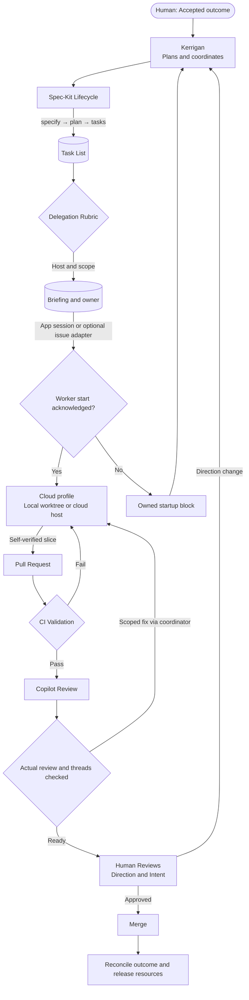

# Kerrigan Architecture

## High-Level Overview

Kerrigan is a multi-agent orchestration system that coordinates specialized AI agents through artifact-driven workflows. The system enables teams to deliver software projects with high quality and minimal human intervention, while maintaining strict human control over key decisions.

The active contract is [session operations](../../playbooks/session-operations.md): direct app sessions are primary and issues are an optional adapter. Two behavioral profiles (`kerrigan` coordinator/shaper and `cloud` executor) run on capability-appropriate hosts. No scheduler, enforced label control, or device isolation is implied by this diagram.

## Architecture Diagram

**Note**: This diagram is rendered using Mermaid syntax. If viewing on GitHub, the diagram should display automatically. If not rendering, see the text description below.

## Key Components

### 1. Control Plane

The coordinator manages accepted work using existing tasks, briefings, blocks and runtime evidence:

- **Optional issue annotations**: not session control or an implemented autonomy-label gate
  - `agent:go`: Issue ready for explicit assignment
  - `agent:wait`: Issue intentionally waiting
  - `agent:local`: Requires human's machine
  - `autonomy:override`: Human-approved exception supported by an actual configured gate
  
- **Status Tracking** (`status.json` where used): records project state, not process control. The owner must explicitly stop/resume the runtime and verify resource release; writing `blocked` or `completed` does not prove those actions happened.
- **Dispatch evidence**: task generation and issue/session creation do not prove worker start. Require ownership acknowledgment, actual base, and scoped execution evidence.

### 2. Agent Roles

Two profiles own the lifecycle; planning/testing/deployment are responsibilities, not separate required profiles:

| Agent | Primary Artifacts | Responsibility |
|-------|------------------|----------------|
| **kerrigan** | Plans, tasks, briefings, decisions, blocks | Coordinate accepted outcomes and routine child decisions; maintain the harness |
| **cloud** | Scoped code, tests, documentation, verification evidence, PR | Implement one accepted slice; fix assigned feedback on the same branch |

### 3. Artifact Layer

All work is expressed through repository artifacts:

- **Specs** (`specs/projects/<name>/`): Source of truth for project requirements
- **Decisions** (`decisions.md`): Architecture decision records (ADRs)
- **Plans** (`plan.md`, `tasks.md`): Milestones and executable tasks
- **Code & Tests**: Implementation with >80% coverage target
- **Runbooks**: Operational playbooks for deployment and maintenance

### 4. Quality Enforcement

Automated validation ensures consistency and quality:

- **Artifact Validators** (`tools/validators/`):
  - Required files exist
  - Required sections present with exact headings
  - Large file detection (warn at 400 LOC, fail at 800 LOC)
  
- **CI Workflows** (`.github/workflows/`):
  - Artifact validation on every PR
  - Actual configured checks, not presumed autonomy-label enforcement
  - Security scanning

### 5. Human Checkpoints

Strategic human involvement at key decision points:

1. **Scope Approval**: Review spec.md goals and non-goals
2. **Architecture Review**: Approve design tradeoffs in architecture.md
3. **Authority**: Reserve meaningful risk/privacy/permission/cost decisions; labels do not grant runtime permissions
4. **PR Review**: Direction and spec alignment after automated technical verification
5. **Status Management**: Coordinator routes runtime pause/resume to the existing owner and records state

## Workflow Phases

### Phase 1: Specification
- Human supplies the accepted outcome in a session (issue context optional)
- `kerrigan` uses Spec Kit to draft scope and clear acceptance criteria
- Human approves scope and non-goals

### Phase 2: Architecture
- `kerrigan` creates the implementation plan and tasks, checking constitution alignment
- Human approves architecture tradeoffs

### Phase 3: Implementation
- Coordinator separately dispatches an explicit executor after task generation
- The acknowledged executor implements features with tests and edge-case coverage
- CI enforces quality bar on every commit

### Phase 4: Deployment
- The assigned executor creates operational runbooks within the accepted slice
- Human reviews production readiness
- Deployment proceeds with documented rollback plan

### Phase 5: Maintenance
- The existing implementation owner responds to assigned failures
- All bug fixes include regression tests
- Status records reflect owner-confirmed runtime actions; they do not enforce pause/resume

## Design Principles

### Artifact-Driven Collaboration
Durable scope, ownership, decisions and evidence live in repository artifacts or retained handoffs; runtime messages carry acknowledged delivery. This ensures:
- **Traceability**: Full audit trail of decisions
- **Persistence**: Work survives across sessions
- **Reviewability**: Humans can inspect any stage

### Quality from Day One
No "prototype mode" — structure, tests, and CI from the start:
- Test-driven development (TDD) is the default
- Linting and formatting configured early
- Small, reviewable PRs that keep CI green

### Stack-Agnostic Design
Kerrigan works with any technology stack:
- Contracts define required artifacts, not specific technologies
- Teams choose their own tools and frameworks
- Validators enforce structure, not implementation details

### Human-in-the-Loop, Not Human-as-Glue
Agents handle implementation details, humans guide strategy:
- **Humans decide**: Goals, scope, architecture, deployment timing
- **Agents execute**: Coding, testing, debugging, documentation
- **Humans approve**: PRs, milestone completion, autonomy grants

## Security Considerations

- **Secret Management**: No secrets in code; use environment variables
- **Dependency Scanning**: Continuous security scanning of dependencies
- **Least Privilege**: Agents operate with minimal required permissions
- **Audit Trail**: All changes tracked via Git history and PR reviews

## Scalability

The system scales naturally:
- **Multiple Projects**: Each project is a folder under `specs/projects/`
- **Parallel Work**: Different agents can work on different projects
- **Incremental Adoption**: Start with one project, expand gradually
- **Cost Control**: Track and limit agent API usage per project

## Historical v1 roadmap (not current operating instructions)

The following original roadmap is retained as history; it is not a claim that these capabilities remain unimplemented or a replacement for the current session-operations contract.

- **Multi-repo Support**: Orchestrate work across multiple repositories
- **Status Dashboard**: Web UI for workflow visibility
- **Advanced Metrics**: Test coverage trends, complexity tracking
- **Cost Analytics**: Detailed API usage and cost breakdowns
- **Spec Kit Integration**: External specification tool integration
