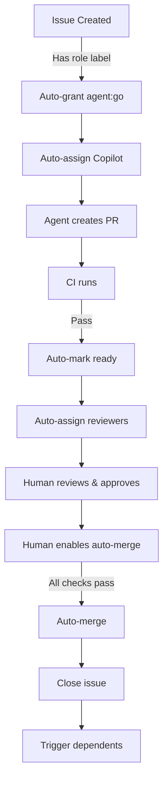

# Auto-Merge Setup Guide

This guide explains how to enable and configure GitHub's auto-merge feature for Kerrigan's autonomous workflow.

## What is Auto-Merge?

Auto-merge is a GitHub feature that automatically merges pull requests when all required status checks pass and reviews are approved. This reduces the manual "click the merge button" step that doesn't add human value.

## When to Use Auto-Merge

Auto-merge is appropriate when:
- ✅ PR has been reviewed and approved
- ✅ All CI checks pass
- ✅ Human has given directional approval ("yes, merge this")
- ✅ Repository has appropriate branch protection rules

Auto-merge is **NOT** a replacement for human review - it's an automation of the procedural merge step after approval.

## Enabling Auto-Merge in Repository Settings

### Step 1: Enable the Feature

1. Navigate to your repository on GitHub
2. Click **Settings** (requires admin access)
3. Scroll to **Pull Requests** section
4. Check the box: **"Allow auto-merge"**
5. Click **Save**

### Step 2: Configure Branch Protection (Recommended)

Auto-merge works best with branch protection rules:

1. Settings → Branches → Branch protection rules
2. Add rule for `main` (or your default branch)
3. Configure:
   - ✅ **Require a pull request before merging**
     - Require approvals: 1 (or more)
   - ✅ **Require status checks to pass before merging**
     - Add required checks: `Agent Gates`, `CI / validate`
   - ✅ **Require conversation resolution before merging**
   - ⚠️ Do **NOT** enable "Require branches to be up to date" (blocks autonomous work)
4. Click **Create** or **Save changes**

## Using Auto-Merge on Pull Requests

### Via GitHub Web UI

1. Open the pull request
2. Click the dropdown arrow next to **"Merge pull request"**
3. Select **"Enable auto-merge"**
4. Choose merge method (squash, merge commit, or rebase)
5. PR will merge automatically when all conditions are met

### Via GitHub CLI

```bash
# Enable auto-merge with squash
gh pr merge <pr-number> --auto --squash

# Enable auto-merge with merge commit
gh pr merge <pr-number> --auto --merge

# Enable auto-merge with rebase
gh pr merge <pr-number> --auto --rebase
```

### Via Workflow Automation

You can create a workflow to auto-enable auto-merge for PRs with certain labels:

```yaml
name: Enable Auto-Merge

on:
  pull_request:
    types: [labeled, opened]

jobs:
  enable_auto_merge:
    runs-on: ubuntu-latest
    if: contains(github.event.pull_request.labels.*.name, 'auto-merge')
    steps:
      - name: Enable auto-merge
        uses: actions/github-script@v7
        with:
          script: |
            await github.rest.pulls.updateBranch({
              owner: context.repo.owner,
              repo: context.repo.repo,
              pull_number: context.payload.pull_request.number
            });
```

**Note**: This requires a GitHub token with appropriate permissions.

## Integration with Kerrigan Workflow

### Recommended Workflow

1. **Issue Creation**: Issue created with role label → auto-gets `agent:go`
2. **Assignment**: Copilot auto-assigned to work on issue
3. **Development**: Agent creates PR, CI runs automatically
4. **Auto-Ready**: PR marked ready when CI passes (via `auto-ready-pr.yml`)
5. **Review**: Reviewers auto-assigned based on role labels
6. **Approval**: Human reviews and approves PR
7. **Enable Auto-Merge**: Human enables auto-merge
8. **Wait**: Auto-merge waits for all checks to pass
9. **Merge**: PR merges automatically when ready
10. **Dependents**: Dependent issues auto-triggered

### Example: Fully Autonomous Flow

For `tier:auto` issues (low-risk, routine work):



## Security and Safety

### Safety Guardrails

- ✅ Auto-merge still requires human approval (via PR review)
- ✅ Branch protection ensures all checks pass
- ✅ Human can disable auto-merge at any time
- ✅ Humans maintain veto power over all merges

### What Auto-Merge Does NOT Do

- ❌ Does not bypass PR reviews
- ❌ Does not skip required status checks
- ❌ Does not merge without approval
- ❌ Does not override branch protection rules

### When NOT to Use Auto-Merge

Avoid auto-merge for:
- ⚠️ Security-sensitive changes
- ⚠️ Breaking changes or migrations
- ⚠️ Changes requiring post-merge manual steps
- ⚠️ Experimental or risky code

Use manual merge for these cases to ensure human is present at merge time.

## Troubleshooting

### Auto-Merge Not Available

**Problem**: "Enable auto-merge" button is grayed out or missing

**Solutions**:
1. Check repository settings: Settings → Pull Requests → Allow auto-merge
2. Ensure you have write/maintain permissions
3. Check if branch protection blocks auto-merge
4. Verify PR has at least one approval (if required)

### Auto-Merge Not Triggering

**Problem**: Auto-merge enabled but PR not merging

**Possible causes**:
1. ❌ Status checks still running or failing
2. ❌ Required reviews not yet approved
3. ❌ Unresolved conversations
4. ❌ Branch protection rules not satisfied
5. ❌ Merge conflicts present

**Debug steps**:
1. Check PR status checks - all must pass
2. Verify all required reviewers approved
3. Check for merge conflicts
4. Review branch protection requirements
5. Look for conversation threads that need resolution

### Accidental Auto-Merge

**Problem**: PR merged when you didn't want it to

**Prevention**:
1. Only enable auto-merge after careful review
2. Use draft PRs for work-in-progress
3. Disable auto-merge if you need more time
4. Use `tier:strategic` label for high-touch issues

**Remediation**:
- PRs can be reverted after merge if needed
- GitHub maintains full history

## Alternative: Manual Approval Workflow

If auto-merge feels too automated, you can use a semi-automated workflow:

1. Agent creates PR
2. Auto-mark ready when CI passes
3. Auto-assign reviewers
4. Human reviews and approves
5. **Human manually clicks merge button** ← This step is manual
6. Dependent issues auto-trigger

This gives human a final "moment of presence" before merge.

## Configuration Reference

### Repository Settings

- **Location**: Settings → Pull Requests
- **Required**: Admin or maintain role
- **Setting**: "Allow auto-merge"

### Branch Protection Rules

- **Location**: Settings → Branches
- **Required**: Admin role
- **Recommended settings**:
  - Require pull request reviews: Yes (1+ approvals)
  - Require status checks: Yes (Agent Gates, CI)
  - Require conversation resolution: Yes
  - Require linear history: Optional
  - Require signed commits: Optional

### Labels for Auto-Merge Control

- `auto-merge` (optional): Signal that this PR should use auto-merge
- `tier:auto`: Issues that can flow through fully autonomous workflow
- `tier:standard`: Standard workflow with acceptance gate only
- `tier:strategic`: High-touch workflow, careful review before merge

## See Also

- [Autonomy Modes](../playbooks/autonomy-modes.md) - Understand autonomy levels
- [GitHub Labels](github-labels.md) - All required labels including tier labels
- [Automation Limits](automation-limits.md) - What can/cannot be automated
- [GitHub Auto-Merge Docs](https://docs.github.com/en/pull-requests/collaborating-with-pull-requests/incorporating-changes-from-a-pull-request/automatically-merging-a-pull-request)
